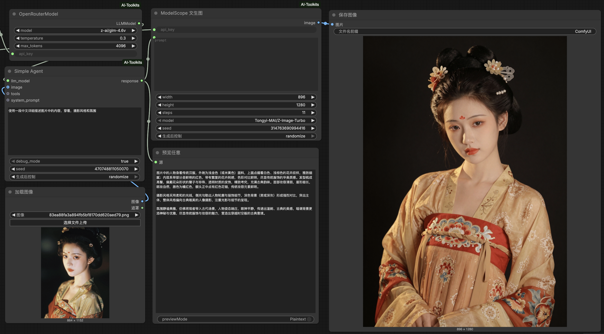

<div align="center">

# ComfyUI AI Toolkits

    



A comprehensive collection of AI-powered nodes for ComfyUI, enabling seamless integration of large language models, image generation, data analysis, financial data, visualization, and cloud storage within your workflows.

**[中文文档](README.zh-CN.md)**

</div>

## Features

- **AI Agents**: Support for multiple LLM providers (OpenAI‑compatible, DeepSeek, Qwen, ModelScope, OpenRouter) with tool‑calling capabilities.
- **Text‑to‑Image**: Generate images from prompts using ModelScope and Hugging Face Inference Providers.
- **Image‑to‑Image**: Edit or transform images with OpenRouter (Gemini/ GPT‑5‑image), ModelScope Qwen, Seedream, and Hugging Face models.
- **Data Processing**: Load CSV data, pick dates, read/write text files.
- **Financial Data**: Fetch stock history, China CPI/PPI via AKShare, and Yahoo Finance data.
- **Visualization**: Create charts (Matplotlib, Plotly, Bokeh) and Mermaid diagrams through AI‑driven code generation.
- **Display & Preview**: Preview HTML, code, and Markdown directly in ComfyUI.
- **Cloud Storage**: Upload images to Cloudflare R2 with public URL generation.
- **Utilities**: JSON parsing, Markdown‑to‑HTML conversion, prompt templating, and more.

## Installation

### Prerequisites
- Python 3.11 or later (recommended; see `.python-version`)
- ComfyUI installed and running

### Steps

1. **Clone the repository** into your ComfyUI `custom_nodes` folder:
   ```bash
   cd /path/to/ComfyUI/custom_nodes
   git clone https://github.com/twn39/ComfyUI-AI-Toolkits.git
   ```

2. **Install Python dependencies** (recommended to use a virtual environment):
   ```bash
   cd ComfyUI-AI-Toolkits
   pip install -r requirements.txt
   ```

3. **Restart ComfyUI**. The nodes will appear under the `AIToolkits` category.


## Node Categories & List

### AI Agents / LLM Providers
| Node | Description |
|------|-------------|
| `OpenAILikeModel` | Generic OpenAI‑compatible model client |
| `DeepSeekModel` | DeepSeek chat/reasoner models |
| `QwenModel` | Qwen models via DashScope |
| `ModelScopeModel` | ModelScope hosted models |
| `OpenRouterModel` | OpenRouter models (Gemini, GPT‑5, Claude, etc.) |
| `SimpleAgent` | Run an agent with a prompt and optional image/tools |
| `ChatAgent` | Create a conversational agent with memory |
| `AgentChain` | Chain multiple agent steps |
| `AgentMathTools` | Provides math expression evaluation tool |
| `AgentJinaReaderTools` | Jina AI reader tool for web/content extraction |
| `AgentMergeTools` | Merge multiple agent tools into a single list |

### OpenAI Native Clients
| Node | Description |
|------|-------------|
| `OpenAiNative` | Generic OpenAI client |
| `OpenAiModelScope` | Client for ModelScope API |
| `OpenAiOpenRouter` | Client for OpenRouter API |
| `OpenAiHuggingFace` | Client for Hugging Face Inference Providers |
| `OpenAiDeepSeek` | Client for DeepSeek API |
| `OpenAiDashScope` | Client for Alibaba DashScope (Qwen) |
| `OpenAiJinaAI` | Client for Jina AI API |
| `OpenAiNativeChat` | Chat completion with vision support |

### Text‑to‑Image
| Node | Description |
|------|-------------|
| `ModelScopeTextToImage` | Generate images via ModelScope (FLUX, Qwen‑Image, etc.) |
| `HFTextToImage` | Generate images via Hugging Face Inference Providers |

### Image‑to‑Image / Image Editing
| Node | Description |
|------|-------------|
| `OpenRouterImage` | Generate/edit images with OpenRouter (Gemini, GPT‑5‑image) |
| `ModelScopeQwenImageEdit` | Edit images with Qwen‑Image‑Edit via ModelScope |
| `SeedreamImage` | Generate/edit images with ByteDance Seedream |
| `HFImageToImage` | Edit images via Hugging Face Inference Providers |

### Data
| Node | Description |
|------|-------------|
| `DataFrameLoader` | Load CSV data into a pandas DataFrame |
| `DatePicker` | Select a date (string) |
| `TextFileLoader` | Load text file from ComfyUI input directory |
| `TextSaver` | Save text to a file in output directory |

### Finance
| Node | Description |
|------|-------------|
| `AKShareStockHistory` | Fetch Chinese stock history via AKShare |
| `AKShareMacroChinaCPI` | Fetch China CPI data (yearly/monthly) |
| `AKShareMacroChinaPPI` | Fetch China PPI data (yearly) |
| `YfinanceTicker` | Fetch stock data from Yahoo Finance |

### Visualization
| Node | Description |
|------|-------------|
| `MatplotlibVisualization` | Generate static charts via AI‑generated Matplotlib code |
| `PlotlyVisualization` | Generate interactive Plotly HTML charts via AI |
| `BokehVisualization` | Generate interactive Bokeh HTML charts via AI |
| `MermaidChart` | Generate Mermaid diagram HTML via AI |

### Display
| Node | Description |
|------|-------------|
| `HTMLPreviewer` | Preview HTML string in ComfyUI |
| `HtmlIFramePreviewer` | Preview HTML/URL in an iframe |
| `CodeViewer` | View code with syntax highlighting |
| `MarkDownViewer` | Preview Markdown content |

### Cloud Storage
| Node | Description |
|------|-------------|
| `CloudflareR2` | Upload image to Cloudflare R2 and get public URL |

### Common Utilities
| Node | Description |
|------|-------------|
| `JSONParse` | Parse JSON string into a dictionary |
| `EmptyChatMessages` | Initialize chat messages with system/user prompt |
| `PromptMerge` | Merge prompts using a template string |
| `MDConvert` | Convert Markdown text to HTML |


## Configuration & API Keys

Most nodes require API keys from respective services. Obtain keys from:

- **ModelScope**: [https://modelscope.cn](https://modelscope.cn)
- **Hugging Face Inference Providers**: [https://huggingface.co/settings/tokens](https://huggingface.co/settings/tokens)
- **OpenRouter**: [https://openrouter.ai/keys](https://openrouter.ai/keys)
- **DeepSeek**: [https://platform.deepseek.com/api‑keys](https://platform.deepseek.com/api‑keys)
- **DashScope (Qwen)**: [https://dashscope.aliyun.com](https://dashscope.aliyun.com)
- **Jina AI**: [https://jina.ai/reader](https://jina.ai/reader)
- **Cloudflare R2**: [https://dash.cloudflare.com](https://dash.cloudflare.com)

Store keys securely; you can input them directly in the node parameters or use ComfyUI’s secret management if available.

## License

This project is released under the [CC BY‑NC‑SA 4.0 License](LICENSE).

## Contributing

Contributions are welcome! Please open an issue or submit a pull request on GitHub.

## Support

For bugs, feature requests, or questions, please use the [GitHub Issues](https://github.com/twn39/ComfyUI-AI-Toolkits/issues) page.

---

*This plugin is not affiliated with any of the mentioned API providers. Use of third‑party services is subject to their respective terms and policies.*